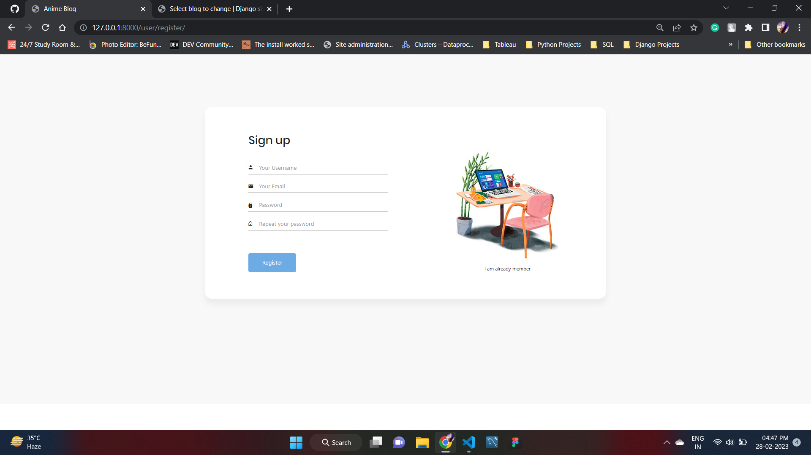
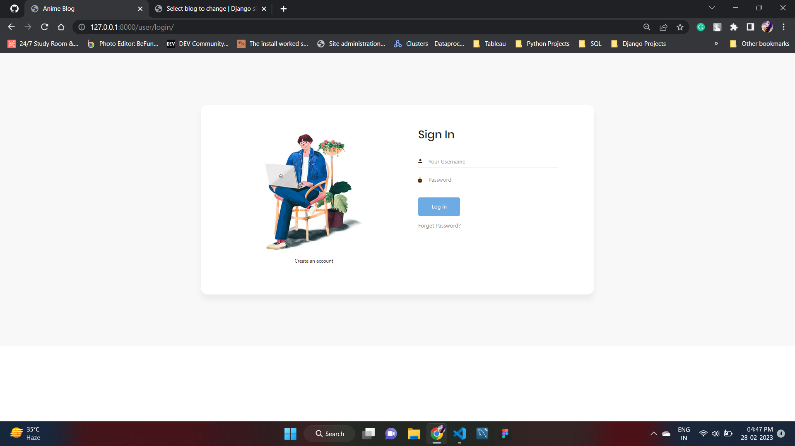
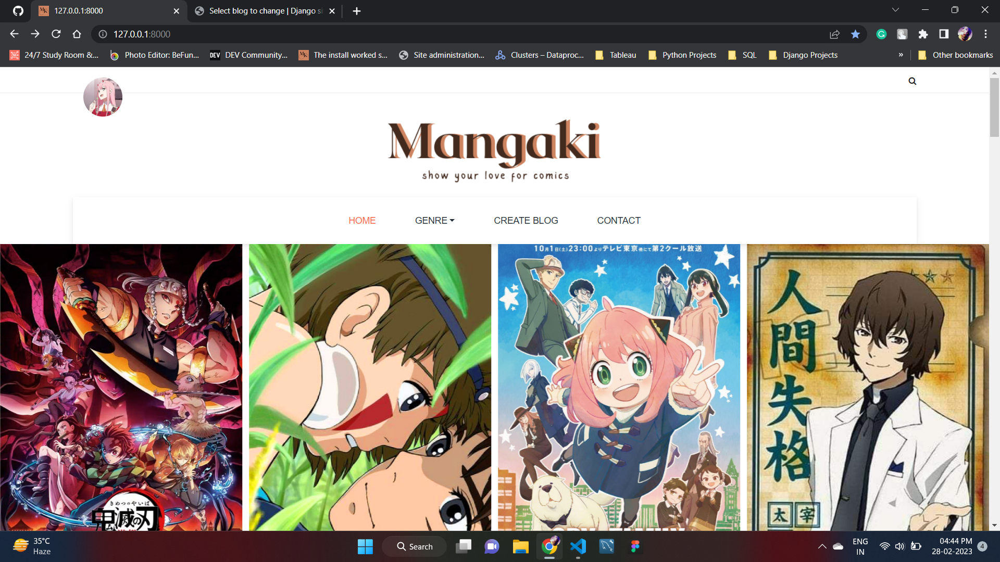
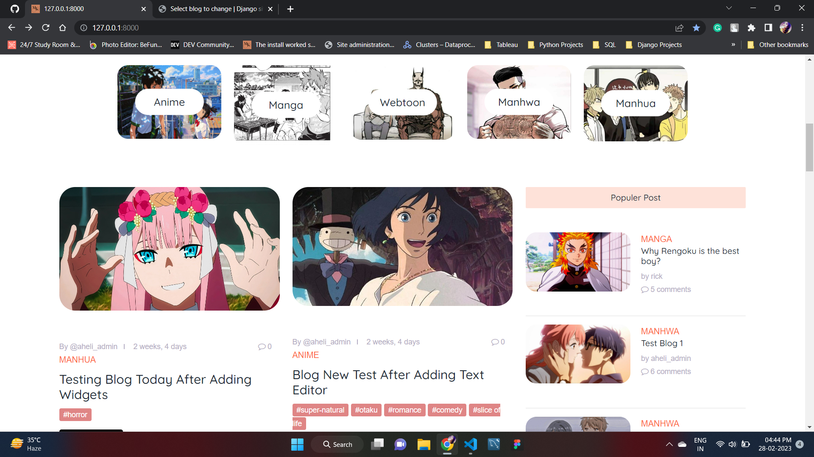
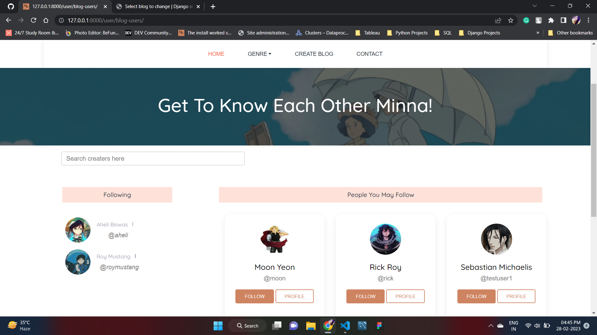
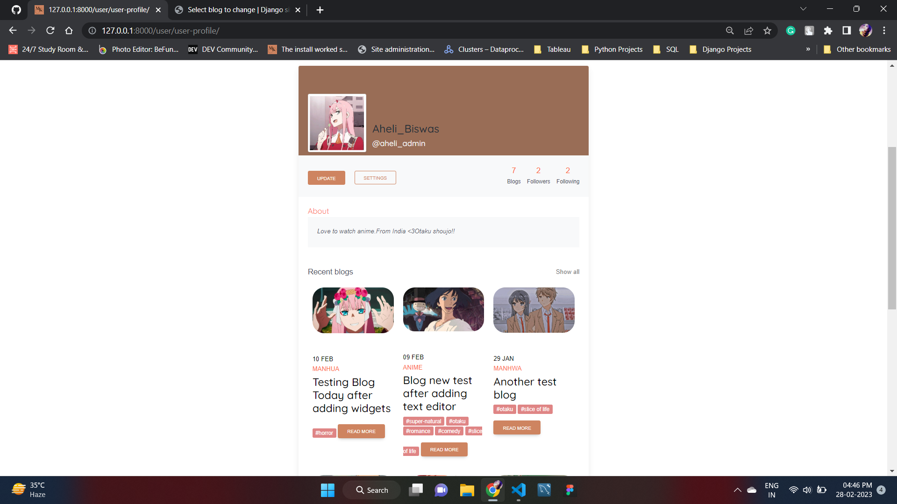
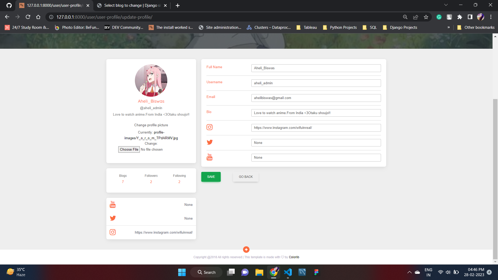

<!-- Improved compatibility of back to top link: See: https://github.com/othneildrew/Best-README-Template/pull/73 -->
<a name="readme-top"></a>
<!--
*** Thanks for checking out the Best-README-Template. If you have a suggestion
*** that would make this better, please fork the repo and create a pull request
*** or simply open an issue with the tag "enhancement".
*** Don't forget to give the project a star!
*** Thanks again! Now go create something AMAZING! :D
-->


<!-- PROJECT SHIELDS -->
<!--
*** I'm using markdown "reference style" links for readability.
*** Reference links are enclosed in brackets [ ] instead of parentheses ( ).
*** See the bottom of this document for the declaration of the reference variables
*** for contributors-url, forks-url, etc. This is an optional, concise syntax you may use.
*** https://www.markdownguide.org/basic-syntax/#reference-style-links
-->


<!-- PROJECT LOGO -->
<br />
<div align="center">
  <a href="">
    
  </a>

<h3 align="center">Mangaki - Django Comic Blog Project</h3>

  <p align="center">
    Django Project to experiment with my hobby and it's based on my passion
    <br />
  </p>
</div>

<!-- ABOUT THE PROJECT -->
## About The Project
  <p>
    Mangaki is a Django-based blog website project where users can login/register, upload-Blog, blog suggestions, follow another user and get followed by anyone and everyone else with email authentication and forget password feature. As blogs are always been a way to express yourself on your field of interest, fun facts, and helping to build an organic community. Comic is a huge genre now and I want everyone to talk about out freely without thinking about any age or gender bounderies.
    </p>

<p align="right">(<a href="#readme-top">back to top</a>)</p>

### Front-end By:
<p><a href="https://themewagon.com/themes/free-html5-food-blog-website-template-yummy/"> Theme Wagon: Yummy – Free HTML5 food blog website template</a>  </p>

### Built With
<p>
1.Django Framework
2.Sqllite3
3.Html
4.CSS
5.JS
</p>

<p align="right">(<a href="#readme-top">back to top</a>)</p>


<!-- GETTING STARTED -->
## Getting Started

To set up my project locally

### Prerequisites

--> Clone the repository using the command below :
  ```sh
 git clone https://github.com/AheliBiswas/mangaki-Django-Blog-Project.git
  ```

--> Move into the directory where we have the project files :
   ```sh
   cd animeblog
   ```
--> Create a virtual environment :
   ```sh
   # Let's install virtualenv first
    pip install virtualenv

    # Then we create our virtual environment
    virtualenv envname
   ```
--> Activate the virtual environment :
   ```sh
    envname\scripts\activate
   ```
--> Install the requirements :
   ```sh
    pip install -r requirements.txt

   ```

<p align="right">(<a href="#readme-top">back to top</a>)</p>


<!-- USAGE EXAMPLES -->
## Running the App

--> To run the App, we use :
   ```sh
    python manage.py runserver

   ```

_⚠ Then, the development server will be started at http://127.0.0.1:8000/_

<p align="right">(<a href="#readme-top">back to top</a>)</p>


<!-- App Preview -->
### App Preview :

<table width="100%"> 
<tr>
<td width="50%">      
&nbsp; 
<br>
<p align="center">
  login
</p>

</td> 
<td width="50%">
<br>
<p align="center">
  register
</p>
  
</td>
</table>
<p align="right">(<a href="#readme-top">back to top</a>)</p>

<table width="100%"> 
<tr>
<td width="50%">      
&nbsp; 
<br>
<p align="center">
  forget password
</p>

</td> 


<table width="100%"> 
<tr>
<td width="50%">      
&nbsp; 
<br>
<p align="center">
  nav
</p>

</td> 
<td width="50%">
<br>
<p align="center">
  home
</p>
  
</td>
</table>
<p align="right">(<a href="#readme-top">back to top</a>)</p>

<table width="100%"> 
<tr>
<td width="50%">      
&nbsp; 
<br>
<p align="center">
  create-update blog
</p>

</td> 
<td width="50%">
<br>
<p align="center">
  users
</p>
  
</td>
</table>
<p align="right">(<a href="#readme-top">back to top</a>)</p>

<table width="100%"> 
<tr>
<td width="50%">      
&nbsp; 
<br>
<p align="center">
  User-Profile
</p>

</td> 
<td width="50%">
<br>
<p align="center">
  User Profile Update
</p>
  
</td>
</table>
<p align="right">(<a href="#readme-top">back to top</a>)</p>


<!-- MARKDOWN LINKS & IMAGES -->
<!-- https://www.markdownguide.org/basic-syntax/#reference-style-links -->
[contributors-shield]: https://img.shields.io/github/contributors/github_username/repo_name.svg?style=for-the-badge
[contributors-url]: https://github.com/github_username/repo_name/graphs/contributors
[forks-shield]: https://img.shields.io/github/forks/github_username/repo_name.svg?style=for-the-badge
[forks-url]: https://github.com/github_username/repo_name/network/members
[stars-shield]: https://img.shields.io/github/stars/github_username/repo_name.svg?style=for-the-badge
[stars-url]: https://github.com/github_username/repo_name/stargazers
[issues-shield]: https://img.shields.io/github/issues/github_username/repo_name.svg?style=for-the-badge
[issues-url]: https://github.com/github_username/repo_name/issues
[license-shield]: https://img.shields.io/github/license/github_username/repo_name.svg?style=for-the-badge
[license-url]: https://github.com/github_username/repo_name/blob/master/LICENSE.txt
[linkedin-shield]: https://img.shields.io/badge/-LinkedIn-black.svg?style=for-the-badge&logo=linkedin&colorB=555
[linkedin-url]: https://linkedin.com/in/linkedin_username
[product-screenshot]: images/screenshot.png
[Next.js]: https://img.shields.io/badge/next.js-000000?style=for-the-badge&logo=nextdotjs&logoColor=white
[Next-url]: https://nextjs.org/
[React.js]: https://img.shields.io/badge/React-20232A?style=for-the-badge&logo=react&logoColor=61DAFB
[React-url]: https://reactjs.org/
[Vue.js]: https://img.shields.io/badge/Vue.js-35495E?style=for-the-badge&logo=vuedotjs&logoColor=4FC08D
[Vue-url]: https://vuejs.org/
[Angular.io]: https://img.shields.io/badge/Angular-DD0031?style=for-the-badge&logo=angular&logoColor=white
[Angular-url]: https://angular.io/
[Svelte.dev]: https://img.shields.io/badge/Svelte-4A4A55?style=for-the-badge&logo=svelte&logoColor=FF3E00
[Svelte-url]: https://svelte.dev/
[Laravel.com]: https://img.shields.io/badge/Laravel-FF2D20?style=for-the-badge&logo=laravel&logoColor=white
[Laravel-url]: https://laravel.com
[Bootstrap.com]: https://img.shields.io/badge/Bootstrap-563D7C?style=for-the-badge&logo=bootstrap&logoColor=white
[Bootstrap-url]: https://getbootstrap.com
[JQuery.com]: https://img.shields.io/badge/jQuery-0769AD?style=for-the-badge&logo=jquery&logoColor=white
[JQuery-url]: https://jquery.com 
